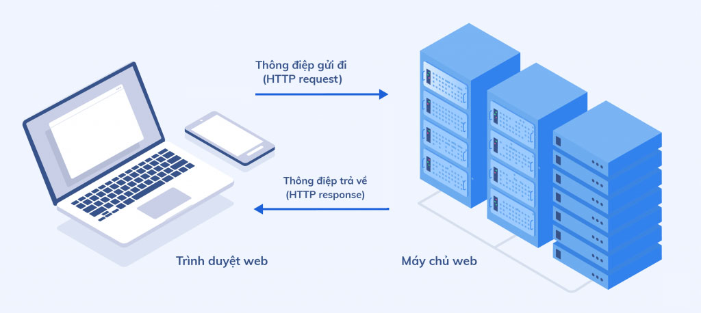

### HTTP Protocol (Giao thức kết nối HTTP)

> #### Khi máy tính của chúng ta gửi yêu cầu kết nối với server, quá trình đó được gọi là Request.

> #### Khi server phản hồi kết quả lại cho máy tính chúng ta, quá trình đó gọi là Response

***

### HTTP Request
>HTTP request là yêu cầu được gửi từ client lên server, để yêu cầu server tìm hoặc xử lý một số thông tin. HTTP request cung cấp cho chúng ta các method (Phương thức) request như:
>* GET
>* POST
>* PUT
>* PATCH
>* DELETE
>* HEAD
>* CONNECT
>* OPTIONS
>* TRACE

*> https://viblo.asia/p/http-request-la-gi-cac-phuong-thuc-http-request-6J3Zgy6A5mB

### HTTP Response
> Khi nhận và phiên dịch một HTTP Request, Server sẽ gửi tín hiệu phản hồi là một HTTP Response bao gồm các thành phần sau:
>* Một dòng trạng thái (Status-Line), VD: 200, 201, 202.. 401, 404, 500...
>* Không hoặc nhiều hơn các trường Header 
>* Phần body chứa dữ liệu  

